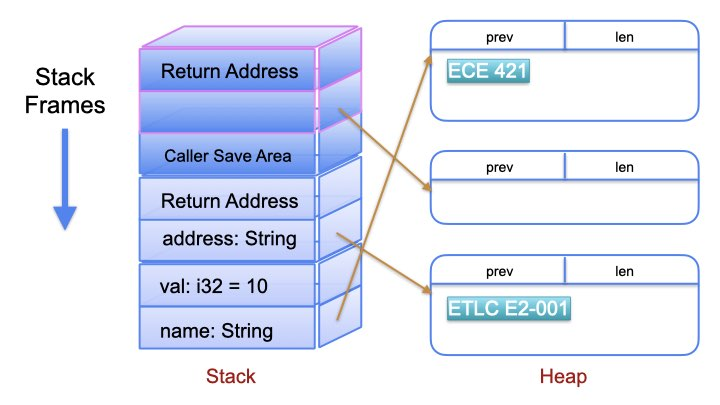

# Stack vs Heap

Stack vs Heap Representation

| Property | Stack | Heap |
|----------|-------|------|
| Scope    | Known | Unknown |
| Speed    | Pre-allocated | Complicated |
| Size     | Somewhat limited | Close to unlimited |
| Locality | Reasonably good | Random |

