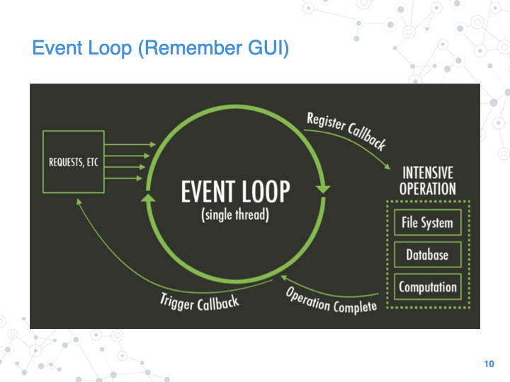

# Async Programming

`async`/`.await` is Rust's language level support for _cooperative multitasking_.

Most operating systems use _preemptive multitasking_, where multiple tasks
share a CPU through context switching. Each task is allowed to run for at most
one _quantum_ or _time slice_ before its context is saved and the next task is
swapped in.

Cooperative multitasking still saves and restores state to share CPUs across
threads, but the context switch only happens when a thread voluntarily
_yields_ the CPU, i.e. threads are never preempted.

Since the preemption points happen at known/convenient times, languages can
support cooperative multitasking with constructs such as _coroutines_ or
`async`/`await`.

### Event-driven Systems

Traditionally, servers implement the asynchronous state machines of their
client requests

1. server accepts a client request
    * `select` is often used to wait on multiple different event sources  
1. the client's request is dispatched
    * quick requests can be serviced synchronously
        - the server can respond to the client immediately 
    * complex requests are handled asynchronously
        - the server must be able to pair asynchronous responses with client requests
1. the client's state is saved
1. the server can now accept other client requests or process back-end completions
1. when a request has been serviced a callback or notification completes the request
1. the server can now respond to the client

